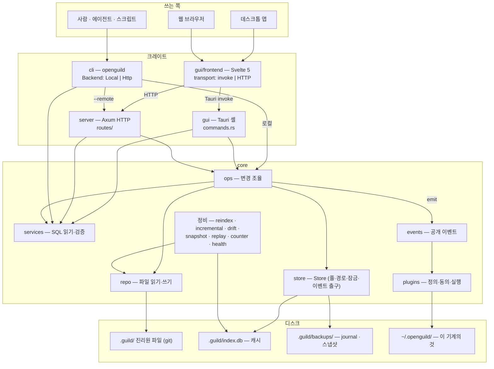

+++
book_id = "BOOK-003"
title = "openguild 아키텍처 — 개괄"
path = "아키텍처"
created_at = "2026-09-06T19:42:06+09:00"
updated_at = "2026-09-23T11:50:12+09:00"
deleted = false
+++

# openguild 아키텍처 — 개괄

> **이 문서는 지금 모습이다.** 코드가 바뀌면 같이 고친다. 모듈끼리 어떻게 이어지는지만
> 적고, 모듈 하나의 속은 `아키텍처/상세/` 에 둔다. **왜 그렇게 정했는지**는
> `설계 기록/` 에 있다 — 거기 적힌 것은 그때의 판단이라 지금과 다를 수 있다.
>
> 목록·수치처럼 코드에서 곧바로 확인되는 것은 여기 옮겨 적지 않고 코드를 가리킨다.
> 손으로 옮긴 목록은 반드시 벌어진다(API 표가 28개 적힌 채 실제는 88개였다).

## 한 장 그림



## 크레이트

| 크레이트 | 무엇 | 수명 |
|---|---|---|
| `core` | 모든 도메인 로직과 저장. 나머지 셋은 **입구일 뿐** 규칙을 갖지 않는다 | 라이브러리 |
| `gui` | Tauri 셸. `commands.rs` 가 `core::ops` / `services` 를 **직접** 부른다 | 오래 삶 |
| `gui/frontend` | Svelte 5 화면 하나. `lib/api/transport.ts` 가 같은 호출을 앱에서는 invoke 로, 브라우저에서는 HTTP 로 보낸다 | — |
| `server` | Axum HTTP. 같은 프런트를 브라우저에 서빙하고 `/api/*` 를 연다 | 오래 삶 |
| `cli` | `openguild`. 로컬이면 `core` 를 직접, `--remote` 면 서버를 HTTP 로 부른다 | 명령 하나 |

**수명이 다르다는 것이 여러 곳에서 차이를 만든다.** CLI 는 명령 하나 끝나면 죽으므로 매번 새로
읽고, 앱과 서버는 시작할 때 읽은 것을 들고 있다(플러그인 정의가 대표적이다 — [[BOOK-007]]).
시동 동기화도 다르다: 앱은 길드를 열 때 바뀐 파일만 캐시에 반영하고(`incremental::sync_on_open`),
CLI 와 서버는 그러지 않는다 — 밖에서 파일을 고쳤으면 `openguild check drift --resync` 나
`reindex` 로 맞춘다.

## core 의 층

| 층 | 하는 일 | 부르는 쪽 |
|---|---|---|
| `repo/` | `.guild/` 파일을 읽고 쓴다. 형식(frontmatter · 마커 · 자동 블록)은 전부 여기 | `ops`, 정비 |
| `services/` | `index.db` 에서 읽는다. 사이클 같은 검증도 여기 | 입구 셋, `ops` |
| `ops/` | **모든 변경의 유일한 길.** 잠금 · journal · 캐시 · 파일 · 이벤트를 정해진 순서로 묶는다 | 입구 셋 |
| `store.rs` | `Store` — 두 DB 풀, 경로, 잠금, 이벤트 출구를 한데 든 컨텍스트 | 모두 |
| `events/` | 공개 이벤트의 이름 · 모양 · "누가 일으켰나" | `ops` 가 낸다 |
| `plugins/` | 이벤트를 받아 사용자 정의를 돌린다 | `Store` 에 꽂힌다 |
| 정비 | `reindex` · `incremental` · `drift` · `snapshot` · `replay` · `counter` · `health` · `maintenance` | 입구 셋, `ops` 끝 |

**읽기는 `services`, 쓰기는 `ops`.** 입구가 `repo` 로 파일을 직접 쓰거나 `index.db` 에 직접
쓰면 캐시가 어긋나고 이벤트가 안 나간다. `ops::lock_coverage` 시험이 `ops` 의 공개 함수마다
잠금을 잡는지(또는 왜 안 잡는지) 분류돼 있는지를 강제한다.

## 변경 한 번의 흐름

`ops` 의 공개 함수 하나가 이 순서로 돈다. 상세는 [[BOOK-006]](저장소).

```text
1. 바뀌기 전 묻기   store.ask_pre(...)       플러그인이 막거나 값을 고칠 수 있다 — 잠금 전
2. 잠금             store.mutation_guard()   프로세스 안(tokio) + 프로세스 사이(.guild/.lock)
3. journal          의도 기록                 복원·재생용 AOF
4. 캐시             index.db 반영
5. 파일             atomic write + 자동 블록 재생성
6. 바뀐 뒤 알림     store.emit_post(...)     기다리지 않는다 — 전달은 다른 스레드
7. 자동 스냅샷      정책에 걸리면             서버·앱은 뒤에서, CLI 는 그 자리에서
```

1 이 잠금 **밖**인 이유: 플러그인이 답하는 동안(밖에 나갈 수도 있다) 다른 변경을 세우지 않으려고.
6 이 기다리지 않는 이유: 느린 훅 하나가 `openguild comment add` 를 붙잡으면 안 되므로.

## 불변식

- **파일이 진리원이다.** `index.db` 는 파일의 일방향 · 폐기가능 투영이다 — 지워도 파일에서 다시
  만든다. DB → 파일 역류는 없다. 상세와 역류 지도는 [[BOOK-001]](index.db 불변식).
- **git 은 선택이다.** git 없이도 journal 과 스냅샷으로 시점 복원이 된다.
- **이벤트는 쓰기를 한 프로세스가 만든다.** 파일을 지켜보다 내는 것이 아니다. CLI 가 쓴 변경에
  대해 같은 길드를 연 앱은 이벤트를 내지 않는다.

## 저장 위치 — 세 곳

| 어디 | 무엇 | 따라가나 |
|---|---|---|
| `.guild/` (git 추적) | 퀘스트 · 댓글 · 이력 · 캠페인 · 타입 · 상태 · 태그 · 템플릿 · 규칙 · 도서관 · 첨부 · 작업 기록 · 플러그인 정의 | 브랜치를 따라간다 |
| `.guild/` (gitignored) | `index.db` · `backups/` · `.lock` · `positions.json` · `*.memo.md` | 이 작업 사본의 것 |
| `~/.openguild/` | 최근 길드 · 언어 · 플러그인 동의·설정값·소스·데이터 · 스킬 마켓플레이스 | 이 기계의 것 |

셋째가 있다는 것을 잊기 쉽다. **동의는 git 으로 오지 않는다** — 동료가 올린 플러그인 정의가 내
기계에서 저절로 돌면 안 되기 때문이다.

## API

목록을 여기 두지 않는다. 정본은 `server/src/routes/mod.rs`.

```bash
grep -oE '"/api/[a-z0-9_{}/.-]+"' server/src/routes/mod.rs | sort -u
```

앱 쪽 대응은 `gui/frontend/src/lib/api/transport.ts` 의 `routeToInvoke` 가 1:1 로 든다.

## 상세 문서

| 문서 | 무엇 |
|---|---|
| [[BOOK-006]](저장소) | 파일 형식 · 캐시 · journal · 스냅샷 · 잠금 · 동기화 · 안전장치 |
| [[BOOK-007]](플러그인 · 이벤트) | 이벤트 계약 · 적재 · 동의 · 실행 · 전달 · 컴포넌트별 차이 · 파일 지도 |
| [[BOOK-001]](index.db 불변식) | 캐시가 파일에 종속되는 규칙과 역류 지도 |
