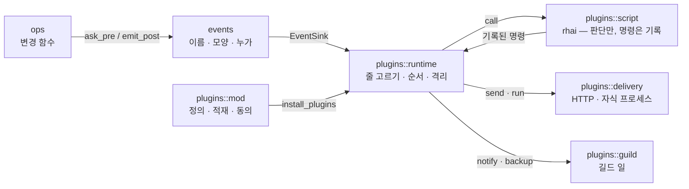

+++
book_id = "BOOK-007"
title = "플러그인 · 이벤트"
path = "아키텍처/상세"
created_at = "2026-09-23T11:49:54+09:00"
updated_at = "2026-09-23T11:50:12+09:00"
deleted = false
+++

# 플러그인 · 이벤트

> 지금 모습이다. **왜 이 모양인지**는 [[BOOK-004]](플러그인 구조 개편 설계)와 각 파일 맨 위
> 주석에 있다. 플러그인을 **만드는** 사람을 위한 설명은 배포되는 스킬(`reference/plugins.md` ·
> `openguild-plugins`)이 맡는다 — 이 문서는 openguild 를 **고치는** 사람을 위한 것이다.

## 네 부분



| 부분 | 한 줄 |
|---|---|
| **이벤트** (`events/`) | `ops` 가 **성공·실패 지점에서 직접** 낸다. 이름과 페이로드가 공개 계약이다 — 내부 함수명·구조체를 그대로 내보내지 않는다 |
| **적재** (`plugins/mod.rs` 외) | 정의를 찾아 읽고, 검사하고, 이 기계의 동의가 있는 것만 꽂는다 |
| **실행** (`plugins/runtime.rs` · `script.rs`) | 이벤트마다 줄을 고르고, `when` 으로 거르고, `with` 를 읽어 함수에 넘긴다. 스크립트는 **판단만** 하고 할 일을 기록한다 |
| **전달** (`plugins/delivery.rs` · `guild.rs`) | 기록된 일을 실제로 한다 — 밖으로(`post` · `run`), 길드에(`notify` · `backup`) |

## 이벤트

- **구독자가 없으면 페이로드를 만들지도 않는다.** 플러그인을 안 쓰는 사용자는 비용이 없다. 적재 결과
  돌릴 것이 하나도 없으면 `Store` 에 출구(sink)를 아예 안 꽂는다.
- **journal 을 겸하지 않는다.** journal 은 실패할 시도도 적고, 결과(새 번호)가 없고, 복원 때 재생된다.
- **이름** `리소스.동사` — `events/names.rs` 한 곳에 모은다.
- **모양** — `events/payload.rs`. 내부 구조체 대신 공개용 모양을 따로 만든다. 모든 이벤트에 대상
  (`subject`)이 같은 모양으로 실린다.
- **누락 검사** — `events/catalog.rs` 가 "내부 변경 ↔ 공개 이벤트" 대조표를 들고, 새 변경 함수가
  이벤트를 빠뜨리면 시험이 깨진다. 빠뜨리면 그 이벤트만 **조용히 구독 불가**가 되기 때문이다.
- **단계** — `pre`(바뀌기 전, `Store::ask_pre`)와 `post`(바뀐 뒤, `Store::emit_post` /
  `emit_post_failed`). 실패도 같은 이름으로 나가고 `ok` 만 갈린다.
- **누가 일으켰나** — `events/origin.rs`. 아래 "되돌이 막기".

**이벤트는 쓰기를 한 그 프로세스가 만든다.** 파일을 지켜보다 내는 것이 아니다. 훅이 부른 CLI 가
댓글을 달면 `comment.added` 는 **그 CLI 안에서** 나고 거기 꽂힌 플러그인이 받는다. 같은 길드를 연
앱은 그 댓글에 대해 아무것도 내지 않는다.

## 정의가 어디서 오나

| 출처 | 어디 | 공유 |
|---|---|---|
| 길드 | `.guild/plugins/{name}/` — 항상 읽는다 | git 으로 팀과 |
| 소스 | 사용자가 등록한 폴더(여러 플러그인을 담은 폴더, 또는 플러그인 폴더 하나). 등록은 `~/.openguild/plugin-sources.json`, "이 길드에서 쓴다" 표시도 거기 | 이 기계만 |

소스의 플러그인은 **제자리에서** 읽는다(복사하지 않는다). 원본을 고치면 바로 반영된다 — 동의가
다시 필요해지는 것까지 포함해서.

**scope** — 정의가 `cli` / `gui` / `server` 중 어디서 돌지 밝힌다. **비어 있으면 적재하지 않는다**
(기본값을 두면 모르는 사이에 서버에서 돈다). 서버에 걸린 것은 그 서버를 쓰는 모두에게 적용된다.

## 동의 — 이 기계에만

- `~/.openguild/plugin-consent.json`. **git 으로 오지 않는다** — 동료가 올린 정의가 내 기계에서 저절로
  돌면 안 된다.
- **지문은 플러그인 폴더의 모든 파일**을 본다. `hook.py` 를 몰래 바꿔치기하지 못하게. 그래서 한 글자를
  고쳐도 다시 묻는다.
- 폴더 밖 `import` 는 **처음 한 번만** 묻고 그 파일이 바뀌어도 다시 묻지 않는다 — 허용 화면이 그
  사실을 밝힌다.
- **자동 허용**(`plugin trust`) — 혼자 쓰는 길드용. 직접 철회한 것은 계속 뺀다.
- 서버는 **HTTP 로 동의를 받지 않는다.** 팀이 공유하는 주소로 받으면 누구의 동의인지 흐려지고
  `run` 을 여는 원격 구멍이 된다. 서버가 도는 기계에서 CLI 로 한다.
- 무엇에 동의하는지는 `plugins/summary.rs` 가 사람 말로 만들고, CLI(`plugin allow`)와 앱이 같은
  재료를 쓴다(`plugins/view.rs`) — 두 화면이 다른 사실을 말하면 안 된다.

**설정값**(`[[inputs]]`)은 `~/.openguild/plugin-values.json` 에 둔다. 정의에는 비밀값 **리터럴을
적을 수 없다** — `${ENV}` 참조만 받는다. 값은 이벤트마다 읽으므로 바꾸면 다음 이벤트부터 먹는다.

## 한 이벤트가 지나가는 길

```text
ops 변경 함수
 ├─ ask_pre ──────────────► pre 줄들: 그 자리에서, 적힌 순서대로        [잠금 전]
 │                            이유를 돌려주면 막고, 칸을 돌려주면 값을 바꾼다
 ├─ mutation_guard ─ 잠금
 ├─ journal · 캐시 · 파일
 ├─ emit_post ────────────► post + wait 줄들: 그 자리에서                [잠금 안 ⚠]
 │                        └► 나머지 post 줄: 전용 스레드 큐에 넣고 바로 돌아온다
 └─ 반환 · 잠금 풀림
                              전용 스레드(하나, 순서 보존)
                               └─ 줄마다: when → with 읽기 → call(rhai) 또는 action
                                   └─ 기록된 명령: send/run → delivery
                                                  notify/backup → guild (함수가 끝난 뒤)
```

- **전달 스레드는 하나다.** 전달은 대부분 기다림(HTTP 응답)이고, 순서가 보존되면 플러그인 쪽에서
  다시 맞출 필요가 없다. 풀을 만들어 얻는 것 없이 실패 모드만 는다.
- **스크립트는 I/O 가 없다.** rhai 샌드박스에서 판단만 하고 `send` · `run` · `notify` · `backup` 은
  **기록만** 한다. 실행은 함수가 끝난 뒤 한다 — 판단 도중 길드가 안 바뀌고, 시험은 기록만 보면 된다.
  읽기용 편의 함수(`status_name` · `link` 등)는 코어가 채워 준다(`plugins/info.rs`).
- **시한** — 줄마다 `timeout_ms`(기본 10초, 코어가 60초에서 자른다). 넘기면 `on_timeout` 대로.
  스크립트가 던지면 `on_error` 대로. 안 적으면 **그냥 진행** — 플러그인이 망가져도 길드는 쓸 수 있게.
- **격리** — 플러그인 하나의 패닉은 `catch_unwind` 로 끊는다. 실패는 삼키지 않고 문제 목록에
  모은다(`Store::plugin_problems`) — 앱의 관리 → 플러그인 '문제' 칸, CLI 의 stderr.

## 전달

| | `post` | `run` |
|---|---|---|
| 무엇 | HTTP 요청 (reqwest blocking) | 자식 프로세스 |
| 받는 것 | 본문 JSON · 헤더 `X-OpenGuild-Plugin-Chain` | stdin 에 JSON · 아래 환경변수 |
| 비밀값 | url · 헤더 · `body_env` 에서 `${ENV}` 를 **보낼 때** 푼다 | 설정값이 자식 환경에 들어간다(args 로 넘기면 `ps` 에 보이므로) |
| 끝 | 2xx 가 아니면 실패 | 종료 코드 0 이 아니면 실패. 시한이 지나면 **프로세스 그룹째** 죽인다(손자까지) |
| OS 차이 | 없음 | `[actions.*.run.windows]` 등으로 갈래. Windows 에서는 콘솔 창을 안 띄운다 |

`run` 자식이 받는 환경변수 — 코어가 **항상** 넣고, 설정값이 이 이름을 덮어쓰지 못한다.

| 이름 | 무엇 |
|---|---|
| `OPENGUILD_PLUGIN_DIR` | 플러그인 코드 폴더 |
| `OPENGUILD_PLUGIN_DATA_DIR` | 이 플러그인의 데이터 폴더 — `~/.openguild/plugin-data/{길드}-{해시}/{플러그인}/` |
| `OPENGUILD_GUILD_DIR` | 길드 루트 — 훅이 `openguild` 를 다시 부를 수 있게(BUG-330) |
| `OPENGUILD_PLUGIN_CHAIN` | 거쳐 온 플러그인 — 되돌이 막기 |

**작업 폴더는 데이터 폴더다.** 플러그인 폴더면 안 된다 — 동의 지문이 그 폴더의 모든 파일을 보므로
훅이 출력을 옆에 쓰는 순간 자기 동의를 깨고 한 번 돌고 멈췄다(BUG-279). 길드 폴더로 옮기기로
정해져 있다(DEV-425).

stdout · stderr 는 지금 **버린다**(`Stdio::null()`) — CLI 의 표준출력에 섞이면 파이프가 깨지기
때문이다. 그래서 실패 이유가 종료 코드만 남는다(BUG-336).

## 되돌이 막기

이벤트마다 **거쳐 온 플러그인 목록**(체인)을 싣는다. 목록에 이미 있는 플러그인에는 보내지 않는다.
목록은 서로 다른 이름으로만 자라므로 반복은 반드시 끝난다 — A → B 는 되고 A → A, A → B → A 는 막힌다.

| 어디서 | 어떻게 |
|---|---|
| 체인이 붙는 곳 | `origin::current()` — 작업(tokio task)에 붙은 값 → 프로세스 기본값 → 없으면 사람 |
| `run` 자식에게 | `OPENGUILD_PLUGIN_CHAIN` (JSON 배열). 환경변수라 파이프 건너 손자까지 간다 |
| CLI 가 받을 때 | 시작할 때 환경에서 읽어 프로세스 기본값으로 — `cli/src/main.rs` 의 `set_process_default` |
| HTTP 로 | 헤더 `X-OpenGuild-Plugin-Chain` (퍼센트 인코딩). 서버는 요청마다 작업에 붙인다 |
| 거르는 곳 | `runtime.rs` — `event.origin.has(이름)` |

**체인이 끊기면 막을 것도 없다.** `env -i` 로 환경을 비우거나, 떼어 던져 놓고 나중에 다른 길로 길드를
바꾸면 "사람이 한 것" 이 된다.

## 컴포넌트마다 다른 것

| | CLI | 앱 | 서버 |
|---|---|---|---|
| 적재 | **명령마다** 새로 읽는다 | 길드를 열 때 한 번 | 시작할 때 한 번 |
| 정의가 바뀌면 | 다음 명령에 바로 | 관리 → 플러그인 **[다시 읽기]** (자동 감지 없음). 허용·철회·길드 전환 때도 다시 꽂는다 | `openguild plugin reload --remote …` (서버 기계에서만) |
| 끝날 때 | 전달을 **2초만** 기다리고 나간다(`OPENGUILD_PLUGIN_DRAIN_MS`). 못 끝내면 경고 — `run` 자식은 부모가 죽어도 혼자 끝낸다 | 계속 산다 | 종료 때 유예 |
| `notify` 가 가는 곳 | stderr | 앱 알림(`AppNotifier`) | stderr |
| 동의 받는 곳 | `plugin allow` | 관리 → 플러그인 | 받지 않는다(그 기계의 CLI) |
| 길드를 안 열었을 때 | — | 적재 자체를 막는다 — 임시 자리(Welcome)가 신뢰 목록에 들어가지 않게 | — |

## 알려진 빈틈

| | |
|---|---|
| **`wait` 줄이 잠금 안에서 돈다** | `emit_post` 는 변경 함수가 잠금을 쥔 채 부르고, 기다리는 줄은 그 자리에서 돈다. 그래서 `wait = true` 인 훅이 `openguild` 로 같은 길드를 바꾸려 하면 **시한까지 멈췄다가 잘린다** — 2026-09-23 실측: 8초 멈춤, 태그 안 달림. 같은 훅을 `wait = false` 로 두면 즉시 된다. `plugins/guild.rs` 주석의 "전달은 잠금이 풀린 뒤라 교착이 없다" 는 기다리지 않는 줄에만 맞다 |
| 자식의 출력을 버린다 | BUG-336 |
| 작업 폴더 | DEV-425 — 길드 폴더로 |
| 시험 파일도 지문에 든다 | REQ-029 |
| 주기 실행이 없다 | REQ-026 |

## 파일 지도

**`core/src/events/`**

| 파일 | 무엇 |
|---|---|
| `mod.rs` | `Event` · `Phase` · `EventSink` · `Events`(출구 한 개, 없으면 아무것도 안 함) |
| `names.rs` | 공개 이벤트 이름 |
| `payload.rs` | 공개 모양 |
| `catalog.rs` | 내부 변경 ↔ 공개 이벤트 대조표, 누락 검사 |
| `origin.rs` | 체인 — 되돌이 막기 |
| `tests.rs` | 이벤트가 **실제 변경에서** 나오는지 |

**`core/src/plugins/`**

| 파일 | 무엇 |
|---|---|
| `mod.rs` | 정의(`PluginDef`) · 읽기 · 검증 · `load_for(scope)` · 데이터 폴더 |
| `sources.rs` | 소스 등록과 "이 길드에서 쓴다" |
| `consent.rs` | 동의 · 지문 · 자동 허용 |
| `values.rs` | 설정값 저장과 풀기 |
| `runtime.rs` | `PluginRuntime` — `EventSink` 구현, 줄 고르기, 전용 스레드, drain |
| `when.rs` | 줄의 조건 |
| `related.rs` | 줄의 `with` — 대상과 연결된 데이터 읽기 |
| `script.rs` | rhai 샌드박스 · 명령 기록 |
| `info.rs` | 스크립트용 읽기 함수(상태 이름 · 링크 …) |
| `delivery.rs` | `post` · `run` 실제 전달 |
| `guild.rs` | `notify` · `backup` — 스크립트가 시킨 길드 일 |
| `summary.rs` | 무엇에 동의하는지 사람 말로 |
| `view.rs` | 컴포넌트가 보여 줄 상태(`PluginStatus`) — 앱과 서버가 같은 모양 |
| `check.rs` · `schema.rs` · `testing.rs` | `plugin check` · `plugin schema` · `plugin test` |
| `tests.rs` | 적재 · scope · 동의 · 비밀값 거부 |

**입구 쪽** — `cli/src/main.rs` 의 `install_plugins_for_cli` · drain, `gui/src/lib.rs` 의
`install_plugins_for_gui` · `AppNotifier`, `gui/src/commands.rs` 의 `plugin_*` 명령,
`server/src/main.rs` 의 적재와 `routes/meta.rs` 의 `reload_plugins`.
