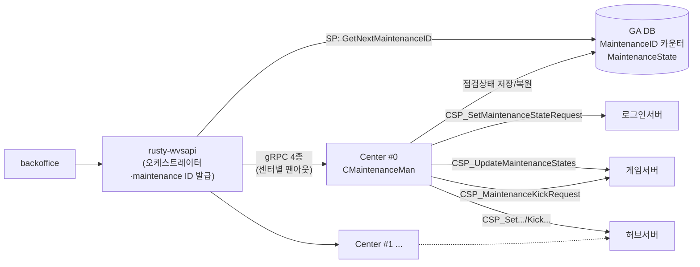

+++
quest_id = "BUG-237"
title = "mermaid 다이어그램 노드 글자 잘림"
status = "testing"
urgency = 3
prerequisites = []
created_at = "2026-08-19T23:57:22+09:00"
updated_at = "2026-08-20T21:47:29+09:00"
deleted = false
+++

## 증상

mermaid 다이어그램 렌더링 시 **노드 안 글자가 잘려 보이는** 현상이 발생한다.
노드 박스 크기가 텍스트를 다 담지 못하는 것으로 보인다.

## 재현 예시

아래 다이어그램에서 실제로 발생했다(사용자 제보).



## 조사 포인트

- `<br/>` 로 줄바꿈된 다중 라인 노드에서 특히 발생하는지
- 한글 + 괄호 조합에서 폭 계산이 틀리는지 (폰트 메트릭 문제 가능성)
- `[(...)]` 실린더 노드처럼 특수 형태에서 더 심한지
- 다이어그램 렌더 시점의 폰트 로딩 타이밍 — 웹폰트가 늦게 적용되면 mermaid 가
  fallback 폰트 기준으로 폭을 계산한 뒤 다시 안 재는 문제가 흔하다. 이 경우
  폰트 로드 완료 후 재렌더가 필요하다.

---

## 원인 (2026-08-20)

**노드가 아니라 엣지 라벨 문제였고, mermaid 가 아니라 우리 CSS 문제였다.**

`.md` 는 BUG-039 때문에 `overflow-wrap: anywhere` 를 건다 — 긴 링크나 inline
code 가 컨테이너 폭을 넘지 않게 하려는 것이다. 그런데 mermaid 는 라벨을
`<foreignObject>` 안의 **HTML** 로 그리므로, 그 규칙을 그대로 상속한다.

그래서 라벨이 **단어 중간에서 강제로 줄바꿈**됐다:

```
CSP_UpdateMaintenanceStates  →  CSP_UpdateMaintenanceSt
                                ates
```

mermaid 는 끊기지 않은 너비를 기준으로 상자 크기를 이미 정해둔 상태라, 줄이
늘어난 텍스트가 상자를 넘쳐 **잘려 보였다.**

## 수정

`MarkdownView.svelte` 의 `.mermaid-rendered` 에서 상속을 끊는다.

```css
overflow-wrap: normal;
word-break: normal;
```

라벨은 저자가 `<br/>` 로 지정한 곳에서만 줄바꿈되고, 그래야 mermaid 의 측정과
실제 렌더가 일치한다.

## 검증 (제보된 다이어그램으로 실측)

BUG-237 본문의 재현 예시를 그대로 렌더해 엣지 라벨 높이를 비교했다.

| 라벨 | 수정 전 | 수정 후 |
|------|---------|---------|
| `CSP_SetMaintenanceStateRequest` | 33px (2줄, 단어 중간 끊김) | **13px (1줄)** |
| `CSP_UpdateMaintenanceStates` | 33px (`…St` / `ates`) | **13px (1줄)** |
| `CSP_MaintenanceKickRequest` | 33px (`…Requ` / `est`) | **13px (1줄)** |
| `gRPC 4종<br/>(센터별 팬아웃)` | 27px (2줄) | 27px (2줄) — **의도대로 유지** |

`overflow-wrap` 계산값이 `anywhere` → `normal` 로 바뀐 것도 확인했다.
스크린샷으로 육안 확인 완료 — 상자를 넘치던 라벨이 모두 온전히 들어간다.

## 조사 과정에서 배제한 가설 (기록)

같은 실수를 반복하지 않도록 남긴다.

1. **`fontFamily: 'inherit'` + `.md` 의 `font-size: 0.9rem` 불일치** —
   `.mermaid-rendered` 에 font-size/font-family 를 고정해봤으나 **지표가 전혀
   변하지 않았다.** 되돌렸다.
2. **`flowchart: { htmlLabels: false }`** — mermaid v11 이 무시했다(적용 후에도
   `foreignObject` 8개 그대로). 죽은 설정이라 제거했다.
3. **측정 방법 자체의 오류** — 처음엔 `getBBox()` 로 도형과 라벨을 비교해
   "노드 5개가 넘침" 이라 판단했는데, `getBBox()` 는 transform 을 무시하는 로컬
   좌표라 두 요소를 직접 비교할 수 없다(폭 차이가 전부 정확히 60px 로 나온 게
   단서였다). `getBoundingClientRect()` 로 다시 재니 **수평 잘림은 0건**이었다.
   결국 스크린샷을 눈으로 본 뒤에야 진짜 증상(엣지 라벨의 단어 중간 끊김)을
   특정할 수 있었다.

## 테스트 방법

1. 본문의 재현 예시 다이어그램이 있는 이 퀘스트를 연다.
2. 엣지 라벨(`CSP_...`)이 단어 중간에서 끊기지 않고 한 줄로 나오는지 확인.
3. `<br/>` 을 쓴 라벨(`gRPC 4종`)은 여전히 두 줄인지 확인.
4. 마크다운 본문의 **긴 링크/inline code** 는 여전히 컨테이너를 넘지 않는지
   확인 — BUG-039 회귀 방지(수정은 `.mermaid-rendered` 안으로만 한정했다).

<!-- openguild:auto-begin — 아래는 자동 생성. 직접 수정하지 마세요. -->
## Sub-quests
- (없음)

## Prerequisites
- (없음)

## Successors
- (없음)
<!-- openguild:auto-end -->
