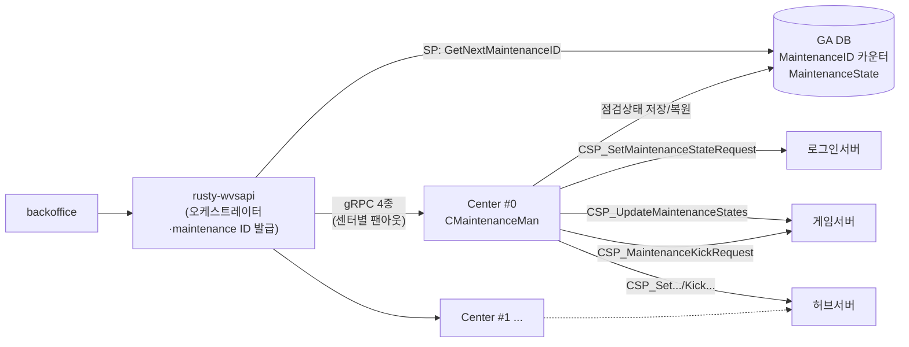

+++
quest_id = "BUG-237"
title = "mermaid 다이어그램 노드 글자 잘림"
status = "open"
urgency = 3
prerequisites = []
created_at = "2026-08-19T23:57:22+09:00"
updated_at = "2026-08-19T23:57:22+09:00"
deleted = false
+++

## 증상

mermaid 다이어그램 렌더링 시 **노드 안 글자가 잘려 보이는** 현상이 발생한다.
노드 박스 크기가 텍스트를 다 담지 못하는 것으로 보인다.

## 재현 예시

아래 다이어그램에서 실제로 발생했다(사용자 제보).

## 조사 포인트

- ` ` 로 줄바꿈된 다중 라인 노드에서 특히 발생하는지
- 한글 + 괄호 조합에서 폭 계산이 틀리는지 (폰트 메트릭 문제 가능성)
- `[(...)]` 실린더 노드처럼 특수 형태에서 더 심한지
- 다이어그램 렌더 시점의 폰트 로딩 타이밍 — 웹폰트가 늦게 적용되면 mermaid 가
  fallback 폰트 기준으로 폭을 계산한 뒤 다시 안 재는 문제가 흔하다. 이 경우
  폰트 로드 완료 후 재렌더가 필요하다.

<!-- openguild:auto-begin — 아래는 자동 생성. 직접 수정하지 마세요. -->
## Sub-quests
- (없음)

## Prerequisites
- (없음)

## Successors
- (없음)
<!-- openguild:auto-end -->
