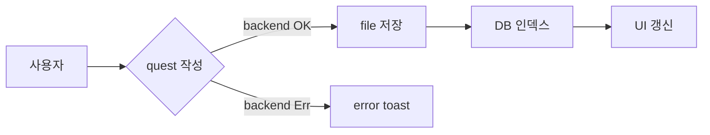
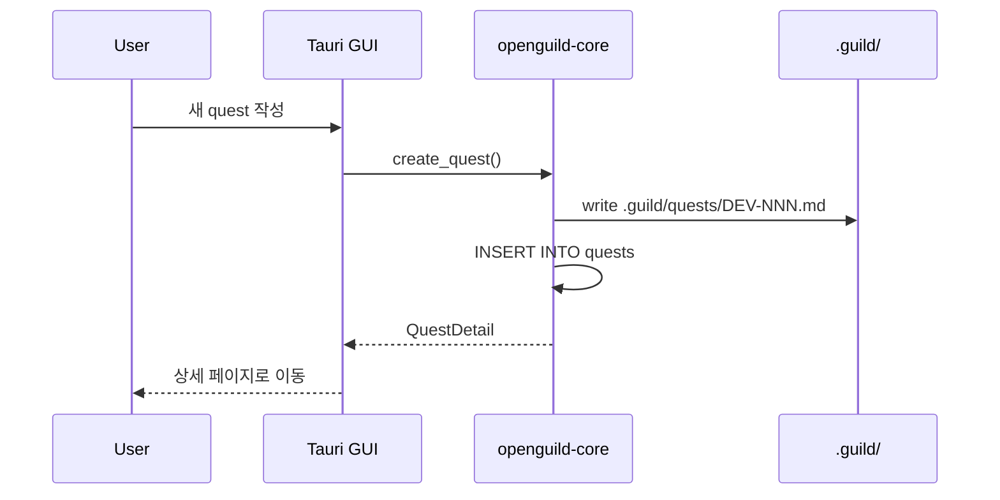
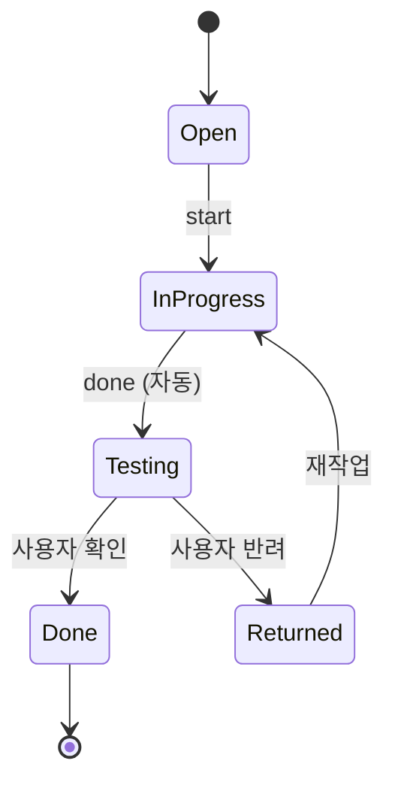

<!-- og-comment id="1" ts="2026-06-07T23:46:45+09:00" author="" -->
이 퀘스트의 본문과 댓글에 테스트용 다이어그램 추가해봐

<!-- og-comment id="2" ts="2026-06-07T23:49:59+09:00" author="claude" -->
## 테스트용 다이어그램

### Flowchart



### Sequence



### State



### 잘못된 코드 (error 박스 표시 테스트)

```mermaid
this is not valid mermaid syntax
```

<!-- og-comment id="3" ts="2026-06-07T23:57:04+09:00" author="" reply_to="2" -->
syntax error시 페이지 최 하단에 폭탄 아이콘과 함께 'Syntax error in text mermaid version 11.15.0'라는 글자가 나오는데, 이부분은 나오지 않도록 수정(댓글에 출력되는건 그대로 둬야함. 페이지 하단에 출력되는것만 제거)

<!-- og-comment id="4" ts="2026-06-08T00:36:36+09:00" author="claude" reply_to="3" -->
원인 확인 — mermaid.js 의 DOM 부작용:

- `mermaid.render(id, code)` 가 내부적으로 `body` 에 임시 `<div id="d{id}">` 를 만들어 그 안에 SVG 렌더.
- syntax error 시 mermaid 는 그 임시 div 에 **bomb 아이콘 + "Syntax error in text mermaid version X.Y.Z"** 를 그려놓고 throw.
- 우리 코드의 catch 는 throw 만 잡고 `pre.replaceWith(err)` 로 **댓글 안의 `<pre>` 만** 교체. body 끝의 leftover div 는 남음.
- 결과: 사용자가 본 "페이지 최하단 폭탄 아이콘".

## 수정 방향

(A) `mermaid.parse(code, { suppressErrors: true })` 로 render 전 syntax 검증. false 면 render 호출 자체를 건너뛰고 우리 inline `.mermaid-error` 만 표시. → mermaid 가 DOM 에 아무것도 안 추가.

(B) catch 안에서 leftover 정리 — `document.getElementById('d' + id)?.remove()`. parse 는 통과했지만 render 단계에서 다른 이유로 실패하는 경우 대비.

권장: A + B. A 가 주된 path, B 가 안전망.

댓글에 표시되는 inline 에러 (`.mermaid-error`) 는 그대로 유지 — 사용자 요구와 일치.

작업 진행 여부 알려주시면 BUG quest 등록 + 수정.
