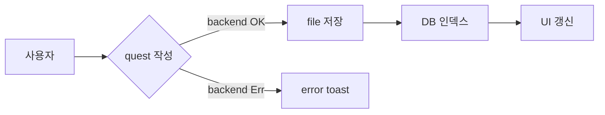
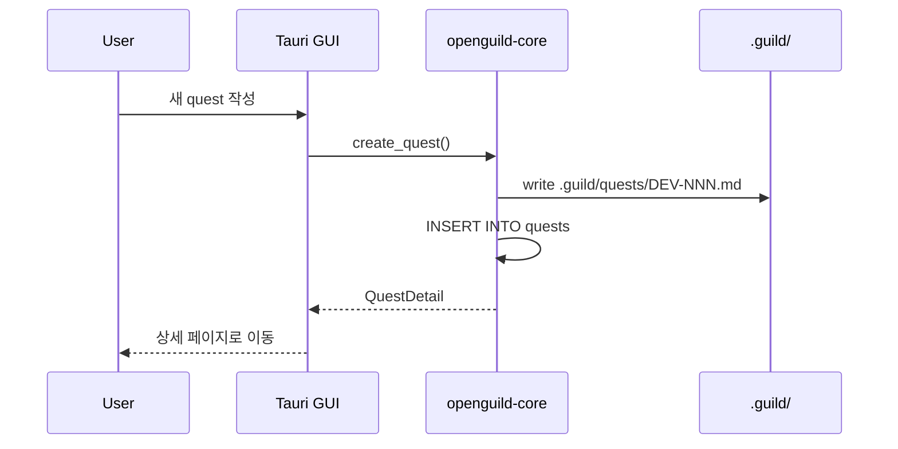
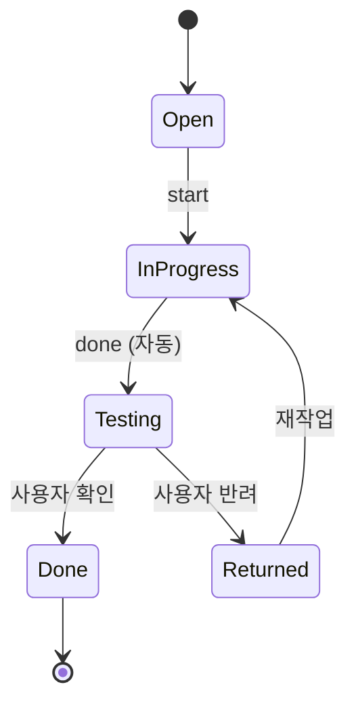

<!-- og-comment id="1" ts="2026-06-07T23:46:45+09:00" author="" -->
이 퀘스트의 본문과 댓글에 테스트용 다이어그램 추가해봐

<!-- og-comment id="2" ts="2026-06-07T23:49:59+09:00" author="claude" -->
## 테스트용 다이어그램

### Flowchart



### Sequence



### State



### 잘못된 코드 (error 박스 표시 테스트)

```mermaid
this is not valid mermaid syntax
```
