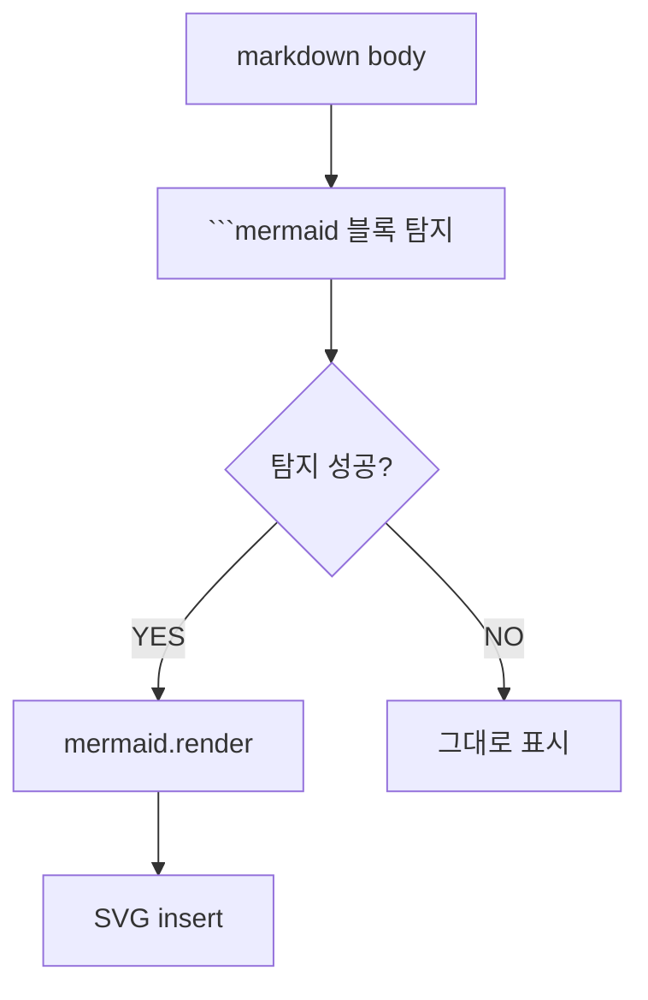

+++
quest_id = "DEV-111"
title = "[gui] 본문에 mermaid 다이어그램 안 보임 — markdown preview 의 mermaid 미지원"
status = "testing"
urgency = 4
prerequisites = []
created_at = "2026-06-06T17:59:37+09:00"
updated_at = "2026-06-07T23:50:32+09:00"
deleted = false
+++

Quest 본문 / 댓글의 markdown 안 ```mermaid 블록이 렌더링 안 됨. 현재 preview (MarkdownView 의 marked.js) 가 mermaid 미지원. 옵션: (a) mermaid.js 동적 import 후 ```mermaid 블록 별도 처리, (b) marked extension 으로 통합, (c) preview library 자체 변경 (예: markdown-it + mermaid plugin). bug 가 아니라 미지원 feature → DEV.

## 본문 다이어그램 (DEV-111 테스트)




<!-- openguild:auto-begin — 아래는 자동 생성. 직접 수정하지 마세요. -->
## Sub-quests
- (없음)

## Prerequisites
- (없음)
<!-- openguild:auto-end -->
