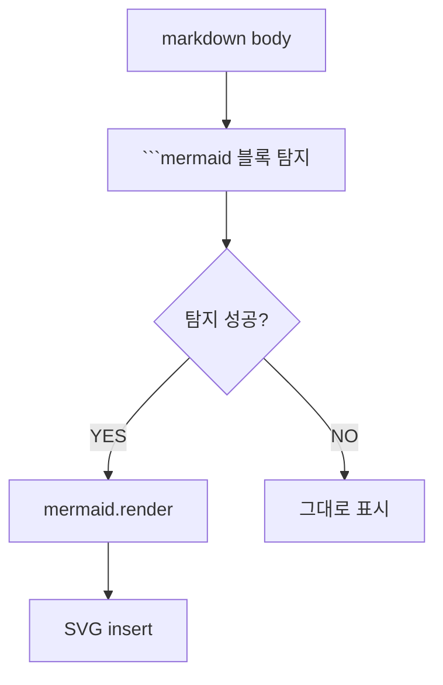

+++
quest_id = "DEV-111"
title = "[gui] 본문에 mermaid 다이어그램 안 보임 — markdown preview 의 mermaid 미지원"
status = "testing"
urgency = 4
prerequisites = []
created_at = "2026-06-06T17:59:37+09:00"
updated_at = "2026-06-07T23:50:32+09:00"
deleted = false
+++

Quest 본문 / 댓글의 markdown 안 ```mermaid 블록이 렌더링 안 됨. 현재 preview (MarkdownView 의 marked.js) 가 mermaid 미지원. 옵션: (a) mermaid.js 동적 import 후 ```mermaid 블록 별도 처리, (b) marked extension 으로 통합, (c) preview library 자체 변경 (예: markdown-it + mermaid plugin). bug 가 아니라 미지원 feature → DEV.

## fix1 (2026-06-08): syntax error 시 bomb 아이콘 leftover 제거

### 증상

사용자 답글 (#3) — syntax error 시 페이지 최하단에 폭탄 아이콘 + "Syntax error in text mermaid version 11.15.0" 가 남음. markdown preview 없는 페이지로 라우트 전환해도 사라지지 않음.

### 원인

`mermaid.render(id, code)` 가 SVG 렌더를 위해 body 에 임시 `<div id="d{id}">` / `<svg id="{id}">` 를 만든다. syntax error 시 그 임시 노드에 bomb 아이콘 + 에러 텍스트를 그려놓고 throw. 우리 catch 는 throw 만 잡고 댓글 안의 `<pre>` 만 교체 → body 의 leftover 가 그대로. SPA 라 라우트 전환에도 body 가 유지되어 모든 페이지에서 보임.

### 수정

- `MarkdownView.svelte`:
  - (A) `mermaid.parse(code, { suppressErrors: true })` 로 render 전 검증. false 면 render 안 부르고 inline `.mermaid-error` 만 표시 — DOM 오염 X.
  - (B) 안전망: render 실패 시 `document.getElementById(id)?.remove()` + `getElementById('d' + id)?.remove()`.
- `+layout.svelte`:
  - `onMount` + `afterNavigate` 에서 `body > svg[id^="mm-"]` / `body > div[id^="dmm-"]` sweep. 이전 코드에서 발생한 leftover / 다른 경로 leftover 까지 청소.

댓글 안의 inline `.mermaid-error` 박스는 그대로 유지.

## 본문 다이어그램 (DEV-111 테스트)




<!-- openguild:auto-begin — 아래는 자동 생성. 직접 수정하지 마세요. -->
## Sub-quests
- (없음)

## Prerequisites
- (없음)
<!-- openguild:auto-end -->
