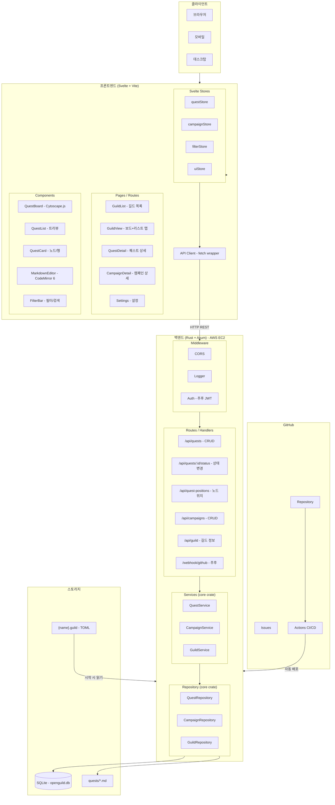

# OpenGuild 소프트웨어 아키텍처

## 전체 구조



## Cargo Workspace 구조

```
backend/
├── Cargo.toml       ← workspace 루트
├── server/          ← Axum 서버 (바이너리)
│   └── src/
│       ├── main.rs
│       ├── routes/
│       └── middleware/
├── core/            ← 공통 라이브러리
│   └── src/
│       ├── models/
│       ├── repository/
│       └── services/
└── tools/           ← 유틸리티 바이너리들
    └── src/
```

## API 엔드포인트 (MVP)

| Method | Path | 설명 |
|---|---|---|
| GET | /api/guild | 길드 정보 조회 |
| GET | /api/quests | 퀘스트 목록 |
| POST | /api/quests | 퀘스트 생성 |
| GET | /api/quests/:id | 퀘스트 상세 |
| PUT | /api/quests/:id | 퀘스트 수정 |
| DELETE | /api/quests/:id | 퀘스트 삭제 |
| PUT | /api/quests/:id/status | 상태 변경 |
| GET | /api/quest-positions | 노드 위치 목록 |
| PUT | /api/quest-positions | 노드 위치 저장 |
