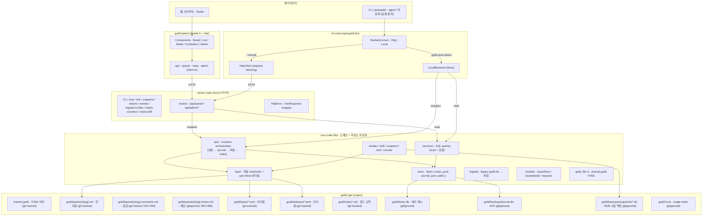

# openguild 소프트웨어 아키텍처

## 전체 구조



**핵심 원칙**:
- `.guild/quests/*.md` 등 **파일이 진리원**. SQLite (`.guild/index.db`) 는 쿼리 캐시 — 손실 시 `reindex` 로 복구.
- **DB 두 종류 분리**: `index.db` 는 쿼리 캐시 (gitignored, 재구축 가능). `backups/journal.db` + `snapshots/*.db` 가 **정식 백업** — git 없어도 시점 복원 보장.
- 모든 mutation 은 `core::ops::*` 통과: journal append → SQL → 파일 atomic write → auto block 갱신.
- 자동 백업: `core::snapshot::maybe_auto_snapshot` 이 ops 끝에서 정책 검사 (ops 50 / 24h).
- git 은 **사용자 선택사항** — git 없이도 snapshot/journal 로 안전 보장.
- drift 자동 복구: `Store::open` 직후 `drift::auto_resync` 가 외부 편집 감지 시 reindex (server / cli / gui 동일, BUG-049).

자세한 이전 경위 / 설계 근거: [`architecture-refactor.md`](./architecture-refactor.md), [`storage-design.md`](./storage-design.md).

## Cargo Workspace 구조 (현재)

```
openguild/
├── Cargo.toml                       ← workspace, members = ["core", "cli", "server", "gui"]
├── openguild.guild                  ← 본 repo 의 마커 (dogfood)
├── .guild/                          ← 본 repo 의 quests / campaigns / 캐시 (dogfood)
├── core/                            ← lib: 도메인 + 저장소 추상화
│   ├── migrations/                  ← sqlx 마이그레이션 (0001~0012, set_ignore_missing 로 backward compat)
│   └── src/
│       ├── lib.rs
│       ├── db.rs                    ← sqlx pool 생성
│       ├── error.rs                 ← AppError (plain Rust)
│       ├── guild_file.rs            ← {name}.guild TOML + find_from_cwd
│       ├── store.rs                 ← Store { index_pool, journal_pool, paths }
│       ├── models/                  ← QuestRow / QuestDetail / Campaign / 요청 타입
│       ├── repo/                    ← 파일 IO 진리원 ⭐
│       │   ├── quest.rs             ← .md frontmatter (TOML) + body + auto block
│       │   ├── campaign.rs          ← DEV-011: .md frontmatter + body GFM 체크리스트
│       │   ├── comments.rs          ← DEV-094/099: {slug}.comments.md (HTML 마커) + {slug}.memo.md
│       │   ├── rules.rs             ← 길드 규칙 {slug}.md (rules/)
│       │   ├── type_def.rs          ← {prefix}.toml + [counter]
│       │   ├── status_def.rs        ← {n}-{slug}.toml
│       │   ├── auto.rs              ← Parent / Sub-quests / Prerequisites 렌더
│       │   ├── seed.rs              ← 기본 시드 + seed_guild_dir
│       │   └── fs.rs                ← atomic write + list_quest_body_files (BUG-047 sibling 제외)
│       ├── services/                ← SQL queries (read 위주)
│       │   ├── quests.rs
│       │   ├── campaigns.rs         ← DEV-011: 캠페인 CRUD / 체크리스트 / 링크
│       │   └── meta.rs
│       ├── ops/                     ← mutation orchestration ⭐
│       │   ├── quests.rs            ← journal + SQL + file + auto block
│       │   ├── campaigns.rs         ← DEV-011: 캠페인 mutation orchestration
│       │   ├── meta.rs
│       │   └── counter.rs
│       ├── snapshot.rs              ← RDB + AutoSnapshotPolicy
│       ├── reindex.rs               ← 파일 → index.db 재구축
│       ├── drift.rs                 ← 외부 편집 감지 + auto_resync
│       ├── counter.rs               ← type counter 무결성 검증
│       ├── lock.rs                  ← .guild/.lock single-writer
│       ├── recents.rs               ← DEV-006: GUI 최근 길드 목록 (per-OS data dir)
│       └── migrate.rs               ← legacy guild.db → 파일
├── cli/                             ← bin `openguild`
│   └── src/main.rs                  ← Backend { Http | Local } — campaign / quest due 포함
├── server/                          ← bin `openguild-server`
│   └── src/
│       ├── main.rs                  ← host / info / snapshot / restore /
│       │                                reindex / migrate-to-files /
│       │                                check-counters / check-drift
│       ├── error.rs                 ← HttpError newtype
│       ├── tests.rs                 ← 통합 테스트
│       └── routes/
│           ├── mod.rs
│           ├── meta.rs              ← /api/quest-types · /api/quest-statuses
│           ├── quests.rs            ← /api/quests/* (CRUD / 관계 / status / type / due)
│           ├── campaigns.rs         ← DEV-011: /api/campaigns/* (CRUD / 체크리스트 / 링크)
│           └── admin.rs             ← /api/admin/{snapshot,restore,drift,reindex}
├── gui/                             ← bin `openguild-gui` — Tauri 2 desktop app
│   ├── Cargo.toml                   ← tauri / tauri-plugin-{dialog,updater,process} + core
│   ├── build.rs                     ← tauri-build (icon / capabilities ACL 생성)
│   ├── tauri.conf.json              ← productName / bundle (NSIS) / plugins.updater
│   ├── capabilities/
│   │   └── default.json             ← core / dialog / updater / process 권한
│   ├── icons/                       ← 아이콘 세트 (32 / 128 / @2x / ico / icns / ios / android)
│   ├── nsis/installer.nsi           ← DEV-034: 멀티 컴포넌트 (GUI / CLI / Server / PATH)
│   ├── gen/                         ← gitignored — tauri-build 자동 생성
│   ├── src/
│   │   ├── main.rs / lib.rs         ← winit + invoke handler 등록
│   │   └── commands.rs              ← Tauri commands (core::ops 호출)
│   └── frontend/                    ← Svelte 5 + Vite (web + Tauri 양쪽 동작)
│       └── src/
│           ├── routes/
│           │   ├── +page.svelte         ← Home / Board / List (?view)
│           │   ├── quests/[id]          ← Quest Detail
│           │   ├── campaigns/           ← Campaign 목록 / 신규 / 상세
│           │   ├── settings/            ← DEV-084: 정보 / 업데이트 등
│           │   ├── welcome/             ← DEV-052: 길드 선택 화면
│           │   └── admin/               ← 백업 / drift / reindex UI
│           └── lib/
│               ├── api/                 ← client.ts + transport (HTTP / Tauri invoke)
│               ├── components/          ← Home / QuestBoard / QuestList / Campaign* /
│               │                          QuestNodeConveyor / UpdateBanner / ...
│               └── utils/               ← datetime / quest-node-svg / quest-list /
│                                          campaign-sort
├── scripts/
│   └── seed-test-data.ps1           ← DEV-075: 테스트 데이터 자동 주입
├── docs/
├── justfile
└── README.md
```

> **변경 이력**:
> - 2026-05-14 server 단일 crate → core/cli/server 분리, `backend/` 폴더 제거.
> - 2026-05-16/17 저장소 모델 전환 — SQLite 진리원 → 파일 진리원 + SQLite 캐시.
>   `core::repo` (파일) + `core::ops` (orchestration) + `core::store` (Store) 신설.
> - 2026-05-21+ `gui/` crate 추가 — Tauri 2 desktop app (DEV-001~006).
> - 2026-05-25 DEV-011 Campaign entity 추가 — 파일 형식 B3 (frontmatter + GFM
>   task list 본문) + 4 테이블 (campaigns / campaign_checklists / campaign_quests
>   / campaign_counters) + CLI / server / GUI 전체.
> - 2026-05-26 DEV-034 멀티 컴포넌트 NSIS installer (GUI / CLI / Server / PATH).
> - 2026-05-27 DEV-076 Quest desired_due / required_due 필드 + Home 임박 / Overdue
>   섹션.
> - 2026-05-28 DEV-063 Tauri 자동 업데이트 (updater + process plugin + 서명
>   파이프라인) + DEV-084 설정 페이지 (`/settings`).
> - 2026-06-04 BUG-047 drift / reindex 가 sibling `.comments.md` / `.memo.md` 를
>   quest 본문으로 오인 — `repo::fs::list_quest_body_files` 로 좁힘.
> - 2026-06-04 BUG-048 recents 테스트 env race — `static OnceLock<Mutex<()>>`
>   직렬화 (사용자 머신 recents 오염 위험 해결).
> - 2026-06-04 BUG-049 GUI 시동 시 자동 reindex — `drift::auto_resync` 가
>   server / cli 와 동일하게 호출됨.
> - 2026-06-04 DEV-094 (댓글) / DEV-099 (메모) — file 진리원 + DEV-102 로 DB 캐시
>   (`quest_comments` / `quest_memos`) + snapshot 백업 합류 (migration 0011).
>   메모의 `user_id=0` sentinel — multi-user (DEV-021) 진입 시 격리 활성.
>   drift::detect_drift 가 sibling 파일도 fresh 감지 (auto reindex 트리거).
> - 2026-06-05 DEV-098 installer NSIS resources 에 README + USAGE 동봉
>   (사용자 친화 시작 가이드).
> - 2026-06-05 DEV-018 `openguild-server info` 에 `--brief` / `--detailed` 모드.
> - 2026-06-05 DEV-070 Quest Detail "Successors" 섹션 — quest_dependencies 역방향.
> - 2026-06-05 BUG-046 Campaign 체크리스트 클릭 시 페이지 최상단 점프 — optimistic
>   update 로 fix.
> - 2026-06-05 DEV-101 UI 크기 슬라이더 + localStorage (rem scale).
> - 2026-06-05 DEV-068 태그 풀스택 — migration 0010 + ops::set_quest_tags +
>   CLI (`quest tag add/rm/list/set`) + HTTP `/api/quests/:id/tags` + Tauri command
>   + Quest Detail tag pill UI + Quest List tag chip 필터 (AND).
> - 2026-06-06 DEV-074 다크 / 라이트 / 시스템 테마 — CSS variable token + store +
>   `<html data-theme>` + 25+ component 의 hardcoded color → var() 마이그레이션.
> - 2026-06-06 DEV-093 캠페인 quest 진행도 — migration 0012 `quest_statuses.
>   counts_as_done` + Home active 카드 progress 2 줄 + Campaign Detail 진행도
>   + Admin Statuses 의 토글 UI.
> - 2026-06-06 DEV-073 Quest Board toolbar 접기 토글 — lane 라벨 가림 해소.
> - 2026-06-06 DEV-065 QuestList Tree / List 뷰 모드 토글 (URL + localStorage).
> - 2026-06-06 DEV-077 arrangeNodesGrouped — cluster 의 y 좌표 lane 별 분리
>   (lane 안 겹침 없으면 같은 row 공유).
> - 2026-06-06 DEV-023 server CLI `vacuum` + `journal-tail` 추가.
> - 2026-06-06 BUG-054 QuestBoard.sorted → $state — long-standing npm check
>   warning 제거 (0 warnings).
>
> 자세한 설계 근거: `docs/architecture-refactor.md`, `docs/storage-design.md`.

## API 엔드포인트 (현재 구현)

### Quest 도메인

| Method | Path | 설명 |
|---|---|---|
| GET    | `/health` | 서버 상태 |
| GET    | `/api/quest-types` | Quest 타입 목록 |
| GET    | `/api/quest-statuses` | Quest 상태 목록 |
| GET    | `/api/quests` | Quest 목록 (생성 역순) |
| POST   | `/api/quests` | Quest 생성 |
| GET    | `/api/quests/:id` | Quest 상세 (sub_quests, prerequisites, position 포함) |
| PATCH  | `/api/quests/:id` | Quest 수정 (title / description / urgency) |
| DELETE | `/api/quests/:id?cascade=ID,ID` | Quest 삭제 (선택적 cascade) |
| GET    | `/api/quests/by/:slug` | slug 로 상세 조회 (예: `DEV-001`) |
| PATCH  | `/api/quests/:id/status` | 상태 변경 |
| PATCH  | `/api/quests/:id/parent` | 부모 변경 (`null` 로 분리) |
| GET    | `/api/quests/:id/candidates?relation=parent\|sub\|prereq` | 관계 추가 후보 |
| POST   | `/api/quests/:id/prerequisites` | 선행 퀘스트 추가 |
| DELETE | `/api/quests/:id/prerequisites/:prereq_id` | 선행 퀘스트 제거 |
| PUT    | `/api/quests/:id/position` | Quest Board 노드 위치 저장 |
| GET    | `/api/quest-positions` | 모든 노드 위치 (alive quest 만) |
| GET    | `/api/quest-dependencies` | 모든 선행 관계 (양 끝 alive 만) |
| GET    | `/api/deleted-quests` | soft deleted 퀘스트 목록 |
| PATCH  | `/api/quests/:id/restore` | soft delete 취소 (alive 복원) |
| GET    | `/api/quests/:id/history` | DEV-013: 상태 / 타입 변경 이력 |
| PATCH  | `/api/quests/:id/type` | DEV-055: type 변경 (slug 바뀜, 관련 파일 cascade) |
| PATCH  | `/api/quests/:id/due` | DEV-076: desired_due / required_due 설정·해제 |
| PATCH  | `/api/quests/:id/tags` | DEV-068: 태그 전체 교체 (body `{tags: string[]}`) |
| GET    | `/api/quests/:id/campaigns` | DEV-011: 이 quest 가 속한 캠페인 목록 |

### Campaign (DEV-011)

| Method | Path | 설명 |
|---|---|---|
| GET    | `/api/campaigns` | 목록 (옵션 `?status=active\|done\|planned`) |
| POST   | `/api/campaigns` | 새 캠페인 (자동 C-NNN slug) |
| GET    | `/api/campaigns/:slug` | 상세 (체크리스트 + linked quests 포함) |
| PATCH  | `/api/campaigns/:slug` | 메타 수정 (title / period / status / description / display_order) |
| DELETE | `/api/campaigns/:slug` | soft delete |
| POST   | `/api/campaigns/:slug/checklist` | 항목 추가 (body 끝에 `- [ ]` append) |
| PATCH  | `/api/campaigns/:slug/checklist/:idx` | 1-based 인덱스 항목 체크/언체크 |
| DELETE | `/api/campaigns/:slug/checklist/:idx` | 항목 삭제 |
| POST   | `/api/campaigns/:slug/quests/:quest_id` | quest 링크 |
| DELETE | `/api/campaigns/:slug/quests/:quest_id` | quest 링크 해제 |
| GET    | `/api/campaigns/active-summaries` | Home carousel 용 — 진행 중 캠페인 + 진행률 |

### Admin (백업 / drift)

> 인증 없음 (MVP). 멀티유저 단계에서 보호 추가.

| Method | Path | 설명 |
|---|---|---|
| POST   | `/api/admin/snapshot` | 즉시 snapshot 생성 |
| GET    | `/api/admin/snapshots` | 사용 가능 snapshot 목록 |
| POST   | `/api/admin/restore` | `{to?: TS}` snapshot 복원 (미지정 시 최신) |
| GET    | `/api/admin/drift` | 파일 vs index.db 일치성 검사 |
| POST   | `/api/admin/reindex` | 파일 → index.db 재구축 |

## 데이터 모델

### 진리원 — `.guild/` 파일

| 자료 | 위치 | 형식 |
|---|---|---|
| Quest 한 건 | `.guild/quests/{slug}.md` | TOML `+++` frontmatter + Markdown body + auto block |
| Campaign 한 건 (DEV-011) | `.guild/campaigns/{slug}.md` | TOML `+++` frontmatter + Markdown body (GFM task list `- [ ]` / `- [x]` 는 어디서든 체크리스트로 추출됨, B3 format) |
| Type 정의 | `.guild/types/{prefix}.toml` | `prefix / color / description / [counter].last_number` |
| Status 정의 | `.guild/statuses/{order}-{slug}.toml` | `sort_order / name_en / name_ko / color` |
| Board 위치 | `.guild/positions.json` | gitignored (UI 상태) |

Quest frontmatter 필드: `quest_id` / `title` / `status` (slug) / `urgency` / `parent` (slug, optional) / `prerequisites` (slug 배열) / `created_at` / `updated_at` / `deleted` / **DEV-076: `desired_due` / `required_due`** (YYYY-MM-DD, optional). Campaign frontmatter 필드: `campaign_id` (`C-NNN`) / `title` / `status` (`active` / `done` / `planned`) / `started_at` / `ended_at` / `linked_quests` (slug 배열) / `display_order` / `created_at` / `updated_at` / `deleted`. 자세한 포맷은 [`storage-design.md`](./storage-design.md).

### 캐시 — `.guild/index.db` (SQLite, gitignored)

쿼리 가속 + 사이클 검증용. 손실 시 `reindex` 로 복구.

| 테이블 | 핵심 컬럼 |
|---|---|
| `quests` | id, quest_type_id, number, title, description, status_id, urgency, parent_quest_id, created_at, updated_at, **deleted_at**, **DEV-076: `desired_due` / `required_due`** (TEXT, YYYY-MM-DD, nullable) |
| `quest_types` | id, prefix, color, description |
| `quest_statuses` | id, name_en, name_ko, color, sort_order, **slug** (DEV-046) |
| `quest_counters` | quest_type_id (PK), last_number |
| `quest_dependencies` | quest_id, prerequisite_id, PK(quest_id, prerequisite_id) |
| `quest_positions` | quest_id (PK), x, y, **quest_slug** (DEV-049) |
| `quest_history` (DEV-013) | id, quest_id, **quest_slug** (DEV-049), ts, op, old_value, new_value, actor |
| **`campaigns`** (DEV-011) | id, campaign_slug (`C-NNN`), title, description, status (`active`/`done`/`planned`), started_at, ended_at, display_order, created_at, updated_at, deleted_at |
| **`campaign_checklists`** | id, campaign_id, text, checked (bool), order_idx |
| **`campaign_quests`** | campaign_id, quest_id, PK(campaign_id, quest_id) |
| **`campaign_counters`** | id (PK, single row=1), last_number |

### Journal — `.guild/backups/journal.db` (AOF)

| 테이블 | 컬럼 |
|---|---|
| `ops` | id, ts, op, args (JSON), result (JSON) |

핵심 무결성:
- 사이클 방지: 부모 변경 / 선행 추가 시 BFS 검증 (index.db 쿼리).
- sub ↔ prereq 상호 배제.
- 직계 부모는 prereq 후보에서 제외.
- Soft delete: 파일 frontmatter `deleted: true`. SELECT 는 `WHERE deleted_at IS NULL` 필터. 파일 위치 그대로 (rename 없음 → git diff 깨끗).
- Counter: type 의 `last_number` 는 단조 증가. ID 재사용 방지 (`check-counters` 로 검증).

## 안전장치 (agent / 자동화 대응)

| 장치 | 위치 | 효과 |
|---|---|---|
| **Journal (AOF)** | `core::store::journal` | 모든 mutation 이 `.guild/backups/journal.db` 의 `ops` 테이블에 append (timestamp + op + args + result JSON). |
| **자동 snapshot** | `core::snapshot::maybe_auto_snapshot` | 매 mutation 끝에 정책 검사 — ops 50 회 또는 24h 도달 시 자동 RDB 스냅샷. 알림 stderr. env `OPENGUILD_AUTO_BACKUP_OPS` / `_HOURS` 로 조정. |
| **수동 snapshot** | CLI `openguild backup`, server `openguild-server snapshot`, GUI `/admin` | 즉시 `.guild/backups/snapshots/{ts}.db` + journal truncate. Retention 7. |
| **Restore** | CLI `openguild restore [--to TS]`, server `openguild-server restore`, GUI `/admin` | snapshot 으로 index.db 복원 (이전 상태는 `.pre-restore.db` 로 자동 백업). |
| **Drift 검사** | server `check-drift [--resync]`, GUI `/admin` | 파일 vs 캐시 불일치 검출. `--resync` 또는 `/admin reindex` 로 복구. |
| **Counter 검증** | server `check-counters [--fix]` | type 의 last_number 무결성 검증. ID 중복 방지. |
| **Single-writer lock** | `core::lock::LockGuard` (`.guild/.lock`) | 동시 mutation 방지. PID stale 자동 강탈. |
| **Soft delete** | quest frontmatter `deleted: true` | 실 삭제 X, `quest restore` 로 복원. 파일 위치 그대로 (git diff 깨끗). |
| **CLI `--yes` 강제** | `cli/` | `openguild quest delete` 는 `--yes` 없으면 거부 |
| **CLI `--dry-run`** | `cli/` | `delete` / `update` 의 영향 미리보기, 실제 호출 X |

## 클라이언트 비교

| | Frontend (Svelte) | CLI (`openguild`) |
|---|---|---|
| 형태 | 웹 GUI | 콘솔 stdin/stdout |
| 통신 | `fetch` (HTTP) | Backend enum: Local 모드는 `core::services::*` 직접 호출, Remote 모드는 `reqwest` blocking |
| 모델 | TypeScript types (`gui/frontend/src/lib/types/index.ts`) | `openguild_core::models::*` 재사용 |
| 서버 의존 | 필수 | 로컬 모드 = 없음 / 원격 모드 = 동일 백엔드 |
| 주 사용자 | 사람 | AI agent / 스크립트 |

Backend 추상화는 `cli/src/main.rs` 의 `Backend` enum. 로컬은 `--guild` 또는 cwd `.guild` 자동탐색
(`core::guild_file::find_from_cwd`), 원격은 `--remote URL` 또는 env `OPENGUILD_REMOTE`.

## 향후 계획 (미구현)

- 멀티유저 인증 (JWT) — DEV-021. 메모의 user_id 격리 (DEV-102) 트리거.
- ✅ 댓글 / 메모 DB 캐시 + snapshot 백업 (DEV-102) — migration 0011 + reindex /
  drift / ops 캐시 sync 완료. 메모 user_id 격리는 DEV-021 진입 시.
- ✅ 태그 (DEV-068) — frontmatter + DB cache + 풀스택 (CLI / HTTP / GUI).
- ✅ 캠페인 quest 진행도 (DEV-093) — status.counts_as_done + 모든 layer.
- ✅ 다크 / 라이트 / 시스템 테마 (DEV-074) — CSS variable backbone + 마이그레이션.
- ✅ Quest List Tree / List 토글 (DEV-065).
- ✅ Quest Detail 후속 퀘스트 (DEV-070).
- ✅ Quest Board toolbar 접기 (DEV-073), arrangeNodesGrouped 개선 (DEV-077).
- 캠페인 댓글 / 메모 (DEV-100) — quest 와 동일 패턴.
- 다국어 (DEV-015) — i18n backbone 부터.
- 첨부파일 (DEV-069) — 새 기능.
- 레인 접기 (DEV-105) / 레인 순서 (DEV-059) — Cytoscape.
- Journal replay (DEV-022) — 시점 복원.
- 길드 다중 동시 접속 (현재 SQLite 단일 파일 가정).
- AWS EC2 배포 — CI 는 GitHub Actions 로 일부 구축됨 (`.github/workflows/check.yml`).
