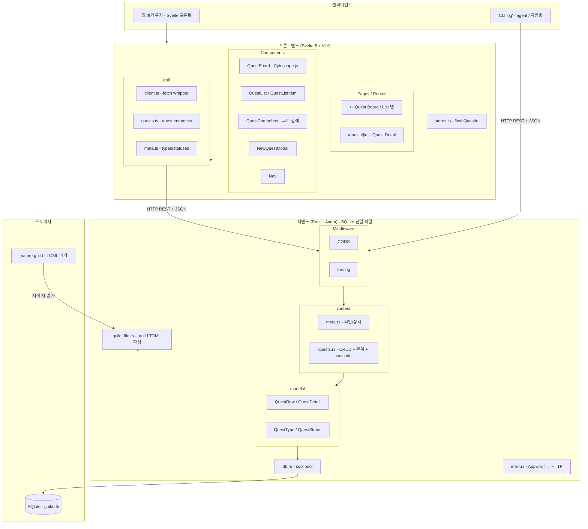

# OpenGuild 소프트웨어 아키텍처

## 전체 구조



## Cargo Workspace 구조 (현재)

```
backend/
├── Cargo.toml                    ← workspace, members = ["server"]
├── migrations/                   ← sqlx 마이그레이션
│   ├── 0001_initial.sql
│   └── 0002_parent_on_delete_set_null.sql
├── seed.sql                      ← 개발용 시드 데이터
└── server/                       ← Axum HTTP 서버 (단일 binary)
    └── src/
        ├── main.rs
        ├── db.rs                 ← sqlx pool, 마이그레이션 실행
        ├── error.rs              ← AppError → HTTP 응답
        ├── guild_file.rs         ← {name}.guild TOML 파싱
        ├── tests.rs              ← 통합 테스트
        ├── models/
        │   ├── meta.rs
        │   └── quest.rs          ← QuestRow, QuestDetail, 요청 타입
        └── routes/
            ├── mod.rs            ← Router 조립
            ├── meta.rs           ← /api/quest-types, /api/quest-statuses
            └── quests.rs         ← /api/quests/* (CRUD + 관계 + cascade)

tools/
└── cli/                          ← Rust CLI (workspace 외부, 독립 crate)
    ├── Cargo.toml
    └── src/main.rs               ← clap + reqwest blocking
```

> **참고**: `core` / `tools` Rust crate 분리는 planning.md 에 언급되어 있으나 미구현.
> 현재는 server 단일 crate 안에 모든 백엔드 로직이 있음. 멀티유저/대규모 확장 단계에서 service / repository 레이어 분리 검토.

## API 엔드포인트 (현재 구현)

| Method | Path | 설명 |
|---|---|---|
| GET    | `/health` | 서버 상태 |
| GET    | `/api/quest-types` | Quest 타입 목록 |
| GET    | `/api/quest-statuses` | Quest 상태 목록 |
| GET    | `/api/quests` | Quest 목록 (생성 역순) |
| POST   | `/api/quests` | Quest 생성 |
| GET    | `/api/quests/:id` | Quest 상세 (sub_quests, prerequisites, position 포함) |
| PATCH  | `/api/quests/:id` | Quest 수정 (title / description / urgency) |
| DELETE | `/api/quests/:id?cascade=ID,ID` | Quest 삭제 (선택적 cascade — 직계 자식 같이 삭제, 나머지는 분리) |
| GET    | `/api/quests/by/:slug` | slug 로 상세 조회 (예: `DEV-001`) |
| PATCH  | `/api/quests/:id/status` | 상태 변경 |
| PATCH  | `/api/quests/:id/parent` | 부모 변경 (`null` 로 분리) |
| GET    | `/api/quests/:id/candidates?relation=parent\|sub\|prereq` | 관계 추가 후보 (사이클 / 자기 / 이미 부모 보유 / 상호배제 / 직계부모 자동 제외) |
| POST   | `/api/quests/:id/prerequisites` | 선행 퀘스트 추가 (사이클·sub·parent 검증) |
| DELETE | `/api/quests/:id/prerequisites/:prereq_id` | 선행 퀘스트 제거 |
| PUT    | `/api/quests/:id/position` | Quest Board 노드 위치 저장 |
| GET    | `/api/quest-positions` | 모든 노드 위치 (alive quest 만) |
| GET    | `/api/quest-dependencies` | 모든 선행 관계 (양 끝 alive 만) |
| GET    | `/api/deleted-quests` | soft deleted 퀘스트 목록 |
| PATCH  | `/api/quests/:id/restore` | soft delete 취소 (alive 복원) |

## 데이터 모델 (현재 스키마)

| 테이블 | 핵심 컬럼 |
|---|---|
| `quests` | id, quest_type_id, number, title, description, status_id, urgency, parent_quest_id (FK ON DELETE SET NULL), created_at, updated_at, **deleted_at** (NULL = alive) |
| `quest_types` | id, prefix, color, description |
| `quest_statuses` | id, name_en, name_ko, color, sort_order |
| `quest_counters` | quest_type_id (PK), last_number — 타입별 자동 증가 카운터 |
| `quest_dependencies` | quest_id (FK CASCADE), prerequisite_id (FK CASCADE), PK(quest_id, prerequisite_id) |
| `quest_positions` | quest_id (PK FK CASCADE), x, y |

핵심 무결성:
- 사이클 방지: 부모 변경 / 선행 추가 시 백엔드에서 BFS 검증
- sub ↔ prereq 상호 배제: 같은 두 퀘스트가 동시에 sub + prereq 일 수 없음
- 직계 부모는 prereq 후보에서도 제외
- Soft delete: `DELETE` 요청은 `deleted_at = now()` 만 set. 모든 SELECT 가 `WHERE deleted_at IS NULL` 필터. 복구는 `PATCH /:id/restore`

## 안전장치 (agent / 자동화 대응)

| 장치 | 위치 | 효과 |
|---|---|---|
| **자동 백업** | `backend/server/src/backup.rs` | startup + 1h 주기로 `VACUUM INTO`, `<guild>/backups/` 에 7일 보관 |
| **Audit log** | `backend/server/src/audit.rs` | 모든 POST/PATCH/PUT/DELETE 호출을 `<guild>/audit.log` 에 timestamped tab-separated 로 기록 |
| **Soft delete** | migration 0003 `deleted_at` | 실 삭제 X, 복원 가능. 영구 삭제는 별도 (미구현) |
| **CLI `--yes` 강제** | `tools/cli` | `og quest delete` 는 `--yes` 없으면 거부 |
| **CLI `--dry-run`** | `tools/cli` | `delete` / `update` 의 영향 미리보기, 실제 호출 X |

## 클라이언트 비교

| | Frontend (Svelte) | CLI (`og`) |
|---|---|---|
| 형태 | 웹 GUI | 콘솔 stdin/stdout |
| HTTP | `fetch` | `reqwest` blocking |
| 모델 | TypeScript types (`src/lib/types/index.ts`) | Rust struct (`tools/cli/src/main.rs`) inline |
| 서버 의존 | 동일 백엔드 | 동일 백엔드 |
| 주 사용자 | 사람 | AI agent / 스크립트 |

CLI 는 frontend 와 같은 endpoint 를 호출. 백엔드 코드 수정 없이 추가됨.

## 향후 계획 (미구현)

- `core` crate 분리: 모델 / 검증 / 서비스 로직을 server / cli / 다른 도구가 공유
- 멀티유저 인증 (JWT)
- Campaign / Comment / Memo / Quest History
- 길드 다중 동시 접속 (현재 SQLite 단일 파일 가정)
- AWS EC2 배포 + GitHub Actions CI/CD
