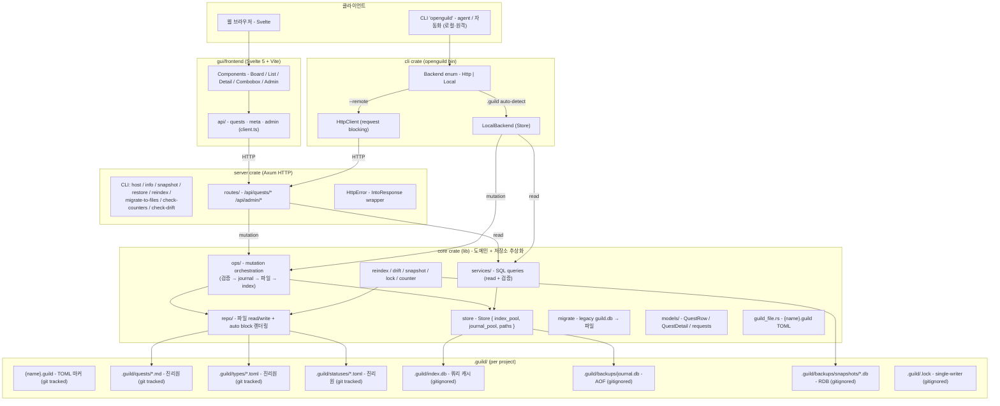

# OpenGuild 소프트웨어 아키텍처

## 전체 구조



**핵심 원칙**:
- `.guild/quests/*.md` 등 **파일이 진리원**. SQLite (`.guild/index.db`) 는 쿼리 캐시 — 손실 시 `reindex` 로 복구.
- 모든 mutation 은 `core::ops::*` 통과: journal append → SQL → 파일 atomic write → auto block 갱신.
- 자동 백업: `core::snapshot::maybe_auto_snapshot` 이 ops 끝에서 정책 검사 (ops 50 / 24h).
- git 사용자 + git 모르는 사용자 둘 다 안전: snapshot/journal 이 git 과 독립.

자세한 이전 경위 / 설계 근거: [`architecture-refactor.md`](./architecture-refactor.md), [`storage-design.md`](./storage-design.md).

## Cargo Workspace 구조 (현재)

```
openguild/
├── Cargo.toml                       ← workspace, members = ["core", "cli", "server"]
├── openguild.guild                  ← 본 repo 의 마커 (dogfood)
├── .guild/                          ← 본 repo 의 quests / 캐시 (dogfood)
├── core/                            ← lib: 도메인 + 저장소 추상화
│   ├── migrations/                  ← sqlx 마이그레이션
│   └── src/
│       ├── lib.rs
│       ├── db.rs                    ← sqlx pool 생성
│       ├── error.rs                 ← AppError (plain Rust)
│       ├── guild_file.rs            ← {name}.guild TOML + find_from_cwd
│       ├── store.rs                 ← Store { index_pool, journal_pool, paths }
│       ├── models/                  ← QuestRow / QuestDetail / 요청 타입
│       ├── repo/                    ← 파일 IO 진리원 ⭐
│       │   ├── quest.rs             ← .md frontmatter (TOML) + body + auto block
│       │   ├── type_def.rs          ← {prefix}.toml + [counter]
│       │   ├── status_def.rs        ← {n}-{slug}.toml
│       │   ├── auto.rs              ← Parent / Sub-quests / Prerequisites 렌더
│       │   ├── seed.rs              ← 기본 시드 + seed_guild_dir
│       │   └── fs.rs                ← atomic write 등
│       ├── services/                ← SQL queries (read 위주)
│       ├── ops/                     ← mutation orchestration ⭐
│       │   └── quests.rs            ← journal + SQL + file + auto block
│       ├── snapshot.rs              ← RDB + AutoSnapshotPolicy
│       ├── reindex.rs               ← 파일 → index.db 재구축
│       ├── drift.rs                 ← 외부 편집 감지 + auto_resync
│       ├── counter.rs               ← type counter 무결성 검증
│       ├── lock.rs                  ← .guild/.lock single-writer
│       └── migrate.rs               ← legacy guild.db → 파일
├── cli/                             ← bin `openguild`
│   └── src/main.rs                  ← Backend { Http | Local }
├── server/                          ← bin `openguild-server`
│   └── src/
│       ├── main.rs                  ← host / info / snapshot / restore /
│       │                                reindex / migrate-to-files /
│       │                                check-counters / check-drift
│       ├── error.rs                 ← HttpError newtype
│       ├── tests.rs                 ← 통합 테스트
│       └── routes/
│           ├── mod.rs
│           ├── meta.rs              ← /api/quest-types · /api/quest-statuses
│           ├── quests.rs            ← /api/quests/*
│           └── admin.rs             ← /api/admin/{snapshot,restore,drift,reindex}
├── gui/
│   └── frontend/                    ← Svelte 5 + Vite (web + 추후 Tauri)
│       └── src/routes/
│           ├── +page.svelte         ← Board / List
│           ├── quests/[id]          ← Quest Detail
│           └── admin/               ← 백업 / drift / reindex UI
├── docs/
├── justfile
└── README.md
```

> **변경 이력**:
> - 2026-05-14 server 단일 crate → core/cli/server 분리, `backend/` 폴더 제거.
> - 2026-05-16/17 저장소 모델 전환 — SQLite 진리원 → 파일 진리원 + SQLite 캐시.
>   `core::repo` (파일) + `core::ops` (orchestration) + `core::store` (Store) 신설.
>
> 자세한 설계 근거: `docs/architecture-refactor.md`, `docs/storage-design.md`.

## API 엔드포인트 (현재 구현)

### Quest 도메인

| Method | Path | 설명 |
|---|---|---|
| GET    | `/health` | 서버 상태 |
| GET    | `/api/quest-types` | Quest 타입 목록 |
| GET    | `/api/quest-statuses` | Quest 상태 목록 |
| GET    | `/api/quests` | Quest 목록 (생성 역순) |
| POST   | `/api/quests` | Quest 생성 |
| GET    | `/api/quests/:id` | Quest 상세 (sub_quests, prerequisites, position 포함) |
| PATCH  | `/api/quests/:id` | Quest 수정 (title / description / urgency) |
| DELETE | `/api/quests/:id?cascade=ID,ID` | Quest 삭제 (선택적 cascade) |
| GET    | `/api/quests/by/:slug` | slug 로 상세 조회 (예: `DEV-001`) |
| PATCH  | `/api/quests/:id/status` | 상태 변경 |
| PATCH  | `/api/quests/:id/parent` | 부모 변경 (`null` 로 분리) |
| GET    | `/api/quests/:id/candidates?relation=parent\|sub\|prereq` | 관계 추가 후보 |
| POST   | `/api/quests/:id/prerequisites` | 선행 퀘스트 추가 |
| DELETE | `/api/quests/:id/prerequisites/:prereq_id` | 선행 퀘스트 제거 |
| PUT    | `/api/quests/:id/position` | Quest Board 노드 위치 저장 |
| GET    | `/api/quest-positions` | 모든 노드 위치 (alive quest 만) |
| GET    | `/api/quest-dependencies` | 모든 선행 관계 (양 끝 alive 만) |
| GET    | `/api/deleted-quests` | soft deleted 퀘스트 목록 |
| PATCH  | `/api/quests/:id/restore` | soft delete 취소 (alive 복원) |

### Admin (백업 / drift)

> 인증 없음 (MVP). 멀티유저 단계에서 보호 추가.

| Method | Path | 설명 |
|---|---|---|
| POST   | `/api/admin/snapshot` | 즉시 snapshot 생성 |
| GET    | `/api/admin/snapshots` | 사용 가능 snapshot 목록 |
| POST   | `/api/admin/restore` | `{to?: TS}` snapshot 복원 (미지정 시 최신) |
| GET    | `/api/admin/drift` | 파일 vs index.db 일치성 검사 |
| POST   | `/api/admin/reindex` | 파일 → index.db 재구축 |

## 데이터 모델

### 진리원 — `.guild/` 파일

| 자료 | 위치 | 형식 |
|---|---|---|
| Quest 한 건 | `.guild/quests/{slug}.md` | TOML `+++` frontmatter + Markdown body + auto block |
| Type 정의 | `.guild/types/{prefix}.toml` | `prefix / color / description / [counter].last_number` |
| Status 정의 | `.guild/statuses/{order}-{slug}.toml` | `sort_order / name_en / name_ko / color` |
| Board 위치 | `.guild/positions.json` | gitignored (UI 상태) |

Quest frontmatter 필드: `quest_id` / `title` / `status` (slug) / `urgency` / `parent` (slug, optional) / `prerequisites` (slug 배열) / `created_at` / `updated_at` / `deleted`. 자세한 포맷은 [`storage-design.md`](./storage-design.md).

### 캐시 — `.guild/index.db` (SQLite, gitignored)

쿼리 가속 + 사이클 검증용. 손실 시 `reindex` 로 복구.

| 테이블 | 핵심 컬럼 |
|---|---|
| `quests` | id, quest_type_id, number, title, description, status_id, urgency, parent_quest_id, created_at, updated_at, **deleted_at** |
| `quest_types` | id, prefix, color, description |
| `quest_statuses` | id, name_en, name_ko, color, sort_order |
| `quest_counters` | quest_type_id (PK), last_number |
| `quest_dependencies` | quest_id, prerequisite_id, PK(quest_id, prerequisite_id) |
| `quest_positions` | quest_id (PK), x, y |

### Journal — `.guild/backups/journal.db` (AOF)

| 테이블 | 컬럼 |
|---|---|
| `ops` | id, ts, op, args (JSON), result (JSON) |

핵심 무결성:
- 사이클 방지: 부모 변경 / 선행 추가 시 BFS 검증 (index.db 쿼리).
- sub ↔ prereq 상호 배제.
- 직계 부모는 prereq 후보에서 제외.
- Soft delete: 파일 frontmatter `deleted: true`. SELECT 는 `WHERE deleted_at IS NULL` 필터. 파일 위치 그대로 (rename 없음 → git diff 깨끗).
- Counter: type 의 `last_number` 는 단조 증가. ID 재사용 방지 (`check-counters` 로 검증).

## 안전장치 (agent / 자동화 대응)

| 장치 | 위치 | 효과 |
|---|---|---|
| **Journal (AOF)** | `core::store::journal` | 모든 mutation 이 `.guild/backups/journal.db` 의 `ops` 테이블에 append (timestamp + op + args + result JSON). |
| **자동 snapshot** | `core::snapshot::maybe_auto_snapshot` | 매 mutation 끝에 정책 검사 — ops 50 회 또는 24h 도달 시 자동 RDB 스냅샷. 알림 stderr. env `OPENGUILD_AUTO_BACKUP_OPS` / `_HOURS` 로 조정. |
| **수동 snapshot** | CLI `openguild backup`, server `openguild-server snapshot`, GUI `/admin` | 즉시 `.guild/backups/snapshots/{ts}.db` + journal truncate. Retention 7. |
| **Restore** | CLI `openguild restore [--to TS]`, server `openguild-server restore`, GUI `/admin` | snapshot 으로 index.db 복원 (이전 상태는 `.pre-restore.db` 로 자동 백업). |
| **Drift 검사** | server `check-drift [--resync]`, GUI `/admin` | 파일 vs 캐시 불일치 검출. `--resync` 또는 `/admin reindex` 로 복구. |
| **Counter 검증** | server `check-counters [--fix]` | type 의 last_number 무결성 검증. ID 중복 방지. |
| **Single-writer lock** | `core::lock::LockGuard` (`.guild/.lock`) | 동시 mutation 방지. PID stale 자동 강탈. |
| **Soft delete** | quest frontmatter `deleted: true` | 실 삭제 X, `quest restore` 로 복원. 파일 위치 그대로 (git diff 깨끗). |
| **CLI `--yes` 강제** | `cli/` | `openguild quest delete` 는 `--yes` 없으면 거부 |
| **CLI `--dry-run`** | `cli/` | `delete` / `update` 의 영향 미리보기, 실제 호출 X |

## 클라이언트 비교

| | Frontend (Svelte) | CLI (`openguild`) |
|---|---|---|
| 형태 | 웹 GUI | 콘솔 stdin/stdout |
| 통신 | `fetch` (HTTP) | Backend enum: Local 모드는 `core::services::*` 직접 호출, Remote 모드는 `reqwest` blocking |
| 모델 | TypeScript types (`gui/frontend/src/lib/types/index.ts`) | `openguild_core::models::*` 재사용 |
| 서버 의존 | 필수 | 로컬 모드 = 없음 / 원격 모드 = 동일 백엔드 |
| 주 사용자 | 사람 | AI agent / 스크립트 |

Backend 추상화는 `cli/src/main.rs` 의 `Backend` enum. 로컬은 `--guild` 또는 cwd `.guild` 자동탐색
(`core::guild_file::find_from_cwd`), 원격은 `--remote URL` 또는 env `OPENGUILD_REMOTE`.

## 향후 계획 (미구현)

- 멀티유저 인증 (JWT)
- Campaign / Comment / Memo / Quest History
- 길드 다중 동시 접속 (현재 SQLite 단일 파일 가정)
- AWS EC2 배포 + GitHub Actions CI/CD
